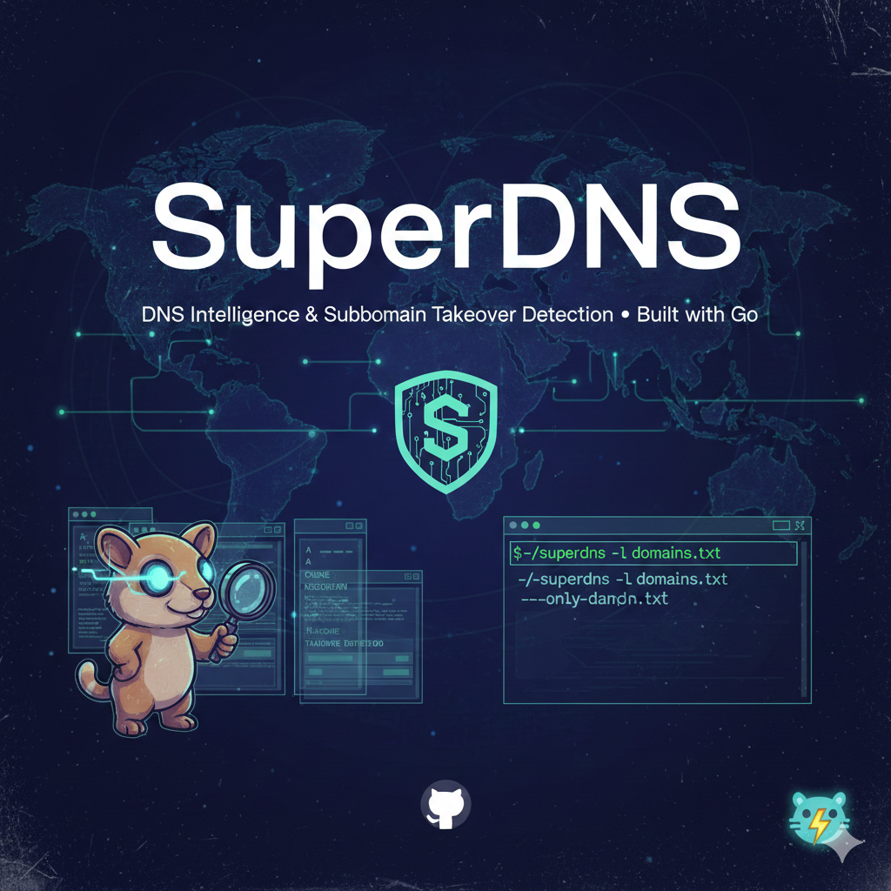

# SuperDNS

<p align="center">
  
</p>

A high-performance Go (Golang) command-line tool for DNS intelligence, designed for security reconnaissance and subdomain takeover detection.

## Features

- **Enumeration**: A, AAAA, CNAME, NS, MX, TXT, SOA, SRV, CAA record collection.
- **Analysis**:
  - Detects "Dangling CNAME" records (potential takeover).
  - Flags SaaS/Cloud providers (AWS, Azure, Heroku, etc.).
  - Detects Wildcard DNS behavior.
- **Performance**: Concurrent querying with worker pools.
- **Output**: Human-readable table format or JSON for pipelines.

## Installation

```bash
go install github.com/akashkampili1/superdns/cmd/superdns@latest
```

## Usage

### Single Domain
```bash
superdns -d example.com
```

### List of Domains
```bash
superdns -l domains.txt
```

### Pipe Input
```bash
cat domains.txt | superdns
```

### JSON Output
```bash
superdns -d example.com --json
```

### Only Show Vulnerable
```bash
superdns -l huge_list.txt --only-dangling
```

## Options

| Flag | Description | Default |
|------|-------------|---------|
| `-d` / `--domain` | Single domain to target | |
| `-l` / `--list` | File containing list of domains | |
| `-c` / `--concurrency` | Number of concurrent workers | 20 |
| `-t` / `--timeout` | DNS query timeout (seconds) | 5 |
| `-r` / `--resolver` | Custom DNS resolver (e.g., 1.1.1.1:53) | 8.8.8.8:53 |
| `--json` | Output results in JSON | false |
| `--only-dangling` | Only show domains with takeover risk | false |

## Logic

The tool performs the following checks:
1. **Resolution**: Queries specific record types to build a profile.
2. **Analysis**:
   - Checks if a CNAME exists but the target fails to resolve (NXDOMAIN/SERVFAIL), indicating a "Dangling CNAME".
   - Matches CNAME targets against known cloud provider suffixes.
   - Probes for Wildcard DNS by querying a random subdomain.
